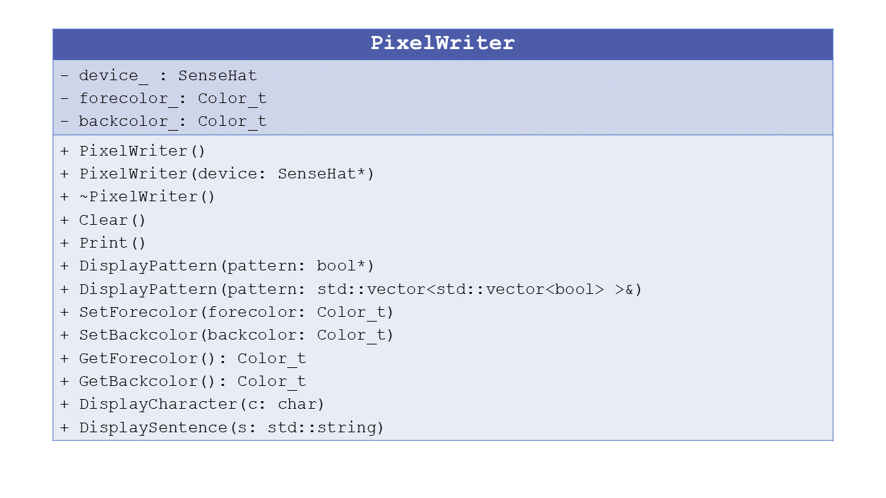

# Specifications of the class *PixelWriter*

The class to implement is called *PixelWriter* and must be able to compute a number
of common statistical values including standard deviation, mean, mediane, and more.

## Step 2.1: first implementation

**Files to write:**
  - source file: *PixelWriter.cpp*
  - header file: *PixelWriter.h*

**Specifications:**
  - You must write an empty class *PixelWriter*. 
  
  - Then you must add the private data member. By conventions, data member have a name in lower case finishing by an underscore charater *_*.
    - a pointer to SenseHat *device_*
    - a default color for the foreground (white) *forecolor_* using the enum Color_t defined in the class SenseHat
    - a default color for the background (black) *backcolor_* using the enum Color_t defined in the class SenseHat

	
  - You must add two constructors:
    - one constructor with no argument where data members will be initialized to the default values.
    - one constructor with a second constructor with a pointer to an instance of SenseHat.
	
  - You must add one destructor.

  - You must add a function *Clear* to set all LEDs to background to color black (no light)

  - You must add a function *DisplayPattern* which take as argument a 8x8 array of bool type and displays
it to the LEDs. 2 prototypes must be implemented: one where the array is in C-format and the another one where the array is a std::vector

  - Finally the class must contain accessors and mutators :
    - for the foreground color: *SetForecolor* and *GetForecolor*
    - for the background color: *SetBackcolor* and *GetBackcolor*
  and  function *Print* for displaying their valeurs at the screen.
  
**Instructions:**
  - Implementing the code corresponding to the specifications inside the files *PixelWriter.cpp* and *PixelWriter.h*.
  - Creating a main file called *main.cpp* for using and testing the class implementation.
  - Building and testing the program to check the class implementation.
  
## Step 2.2: adding display functionnalities

**Specifications:**
  - You must add a function *DisplayCharacter* which takes in argument a character which must be displayed at the
screen with the good colors. For that, the developer needs to download the file font.h
from the ESIPAP indico and analyze it for understanding how to use it.
	 
  - You must add a function *DisplaySentence* which takes in argument a std::string containing a sentence to dis-
play with the LEDs
  
  - Finally the class must contain a function *Clear* for respectively reseting the data member (set to default value).
   
**Instructions:**
  - Implementing the code and updating the file *main.cpp* for using and testing the class implementation.
  - Building and testing the program to check the class implementation.

## Step 2.3: enriching the structure of the class

We would like to improve the structure of the class. These improvements are not crucial for
the next developments. Their goal is purely pedagogical.

**Specifications:** 
  - Add a copy constructor to the class.
  - Associate the reserved word const to the appropriated
functions.
  - Overload the operator << to display the data member values when std::cout is applied directly to instance of this class.
  - Overload the operator [>> to display a std::string on the LEDs.

**Instructions:**
  - Implementing the code and updating the file *main.cpp* for using and testing the class implementation.
  - Building and testing the program to check the class implementation.
 
  
## Summary: the UML diagram 

   
